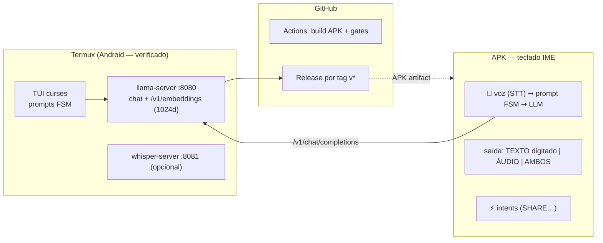

# local-embeding — LLM local p/ RAG + voz, teclado Android (IME) + TUI Termux

Stack **contract-first**: um endpoint OpenAI-compat (`llama-server` no Termux — **verificado em dispositivo real**) servindo chat/embedding/rerank; um **APK teclado** (IME) que conversa por **intent com prompts FSM**, entra por **voz** e devolve **texto digitado (como teclado) ou áudio** — você escolhe — inclusive disparando **intents Android**; uma **TUI no Termux** para criar/rodar prompts; e **GitHub Actions** que builda o APK a cada push.



> Docs gêmeos: [EMBED-RAG-LOCAL](docs/EMBED-RAG-LOCAL.md) · [EMBED-RAG-CLOUD](docs/EMBED-RAG-CLOUD.md) · [DECISÃO](docs/EMBED-RAG-DECISAO.md) · [VOZ](docs/VOICE-LLM.md). Wiki de pesquisa (fontes 2026): `.llm-wiki/` (regenere o meta com `python tools/wiki_meta.py`).

---

## 1. Setup do endpoint no Termux (uma vez — comandos VERIFICADOS em 2026-09-14)

```bash
# toolchain + build (~5 min em 8 cores; sem root)
pkg install -y git clang cmake ninja python libandroid-spawn wget unzip
git clone --depth 1 https://github.com/ggml-org/llama.cpp ~/llama.cpp
cd ~/llama.cpp && cmake -B build -DGGML_NATIVE=ON -DLLAMA_BUILD_TESTS=OFF -DLLAMA_BUILD_EXAMPLES=OFF -DCMAKE_BUILD_TYPE=Release \
  && cmake --build build --target llama-server -j"$(nproc)"

# modelos INDICADOS PELO OPERADOR (models.json) — baixe o que quiser:
bash scripts/baixar-modelos.sh --list
bash scripts/baixar-modelos.sh --id chat        # Qwen3-1.7B Q8 (chat no telefone)
bash scripts/baixar-modelos.sh --id embedding   # Qwen3-Embedding-0.6B Q8 (RAG, verificado: 1024d, 135ms)

# subir (rode de build/bin — libs .so estão lá)
cd ~/llama.cpp/build/bin
LD_LIBRARY_PATH=. ./llama-server -m ~/models/Qwen3-1.7B-Q8_0.gguf --host 127.0.0.1 --port 8080 -c 8192 -t 6
# embedding em outra porta (mesmo binário):
# LD_LIBRARY_PATH=. ./llama-server -m ~/models/Qwen3-Embedding-0.6B-Q8_0.gguf --embedding --pooling last --port 8082 -t 6
curl -s http://127.0.0.1:8080/v1/models   # ✅ deve listar o modelo
```

Números medidos no dispositivo (embedding 0.6B): carga 3,15s · `/v1/embeddings` 1024 dims · 135ms/input solo · 253ms batch×8. Nota: `--mlock` não existe mais (use `--mmap mmap+mlock` se quiser).

## 2. APK — teclado com conversa por intent (prompts FSM + voz + intents)

**Conseguir o APK**: Actions ➞ CI ➞ job `APK build` ➞ artifact `local-embed-keyboard-debug` (ou Release em tag `v*`). Instale (`termux-open app-debug.apk` ou ADB).

**Usar**:
1. Abra o app **Local Embed Teclado** ➞ endpoint `http://127.0.0.1:8080/v1`, modelo, **Testar endpoint**, **Conceder microfone**.
2. Ajustes ➞ Sistema ➞ Teclados ➞ ative **Local Embed Teclado**.
3. Em **qualquer campo de texto** de qualquer app:
   - **🎤 falar** → ditado (STT do sistema, pt-BR) insere o texto;
   - seleciona o **prompt FSM** (botão roda a lista) ➞ **▶ rodar** → processa o texto do campo pelo prompt no LLM local;
   - **saída**: botão de modo `TEXTO ➞ ÁUDIO ➞ AMBOS` — texto digitado pelo teclado no campo, falado (TTS), ou os dois;
   - **⚡ ação** (quando o prompt declara `intent_action`) → dispara um Intent Android (ex.: `ACTION_SEND` compartilha a resposta).

**Prompts FSM** (`prompts/*.json` — master do repo; o APK usa a cópia em `apps/android/app/src/main/assets/prompts/`):

```json
{
  "id": "revisao-codigo",
  "name": "Revisão de código em 2 passos",
  "steps": [
    {"id": "s1", "label": "Listar problemas", "template": "Revise…:\n{{input}}"},
    {"id": "s2", "label": "Sugerir correções", "template": "Para cada problema:\n{{prev}}\nsugira…"}
  ],
  "intent_action": "android.intent.action.SEND"
}
```
Variáveis: `{{input}}` = texto do campo; `{{prev}}` = saída do passo anterior. FSM = a sequência de passos; cada passo é uma chamada ao endpoint.

## 3. TUI Termux — mesma coisa no terminal

```bash
# zero hardcode: config por env (ou backend.toml — veja backend.toml.example)
export EMB_BASE_URL=http://127.0.0.1:8080/v1 EMB_MODEL=qwen3-1.7b
python3 apps/tui/tui.py
# menu: 1 executar prompt FSM · 2 chat · 3 testar endpoint · 4 modelos do operador · 5 criar prompt
```
Zero dependências (curses); **fail-closed**: sem `EMB_BASE_URL`/`EMB_MODEL` a TUI não sobe. Criar prompt na TUI grava em `prompts/`; CLI do core: `python3 -m apps.core list|validate|run` (ver [docs/HARNESS.md](docs/HARNESS.md)).

## 4. Modelos indicados pelo operador (LLM assistente)

`models.json` = manifest curado com URLs **verificadas** (HEAD 200) — chat (Qwen3-1.7B Q8), embedding (0.6B Q8, o mesmo do teste real), STT (whisper small), TTS Piper pt-BR e Kokoro ONNX (+ vozes com `pf_dora` pt-BR). `scripts/baixar-modelos.sh --list|--id X|--all`. Reranker marcado `verified:false` até confirmar GGUF com `pooling_type=RANK`.

## 5. CI/CD — loop GitOps determinístico

- **CI** (`.github/workflows/ci.yml`): gates `APK build`, `TUI smoke`, `Core unit`, `Hardcode scan`, `E2E backend`, `Docs links`, `Workflows YAML` — dispara em qualquer push/PR.
- **CD** (`cd.yml`): tag `v*` ➞ Release com o APK anexado.
- **Loop de incremento** (R1–R9): `bash scripts/iniciar-sessao.sh` (estado: git+PRs+débitos+WAL) ➞ branch `feat|fix|docs/slug` ➞ push (CI gateia) ➞ VERMELHO? corrige **no branch** e push de novo ➞ verde ➞ PR ➞ `gh pr merge --auto` (gates required via `scripts/protege-main.sh`) ➞ main ➞ tag.
- Repo **público** ➞ Actions rodam (sem janela). Se for privar: `scripts/flip-public.sh` / `flip-private.sh` (janela + catch-up).
- Auto-merge: `bash scripts/protege-main.sh camillanapoles/local-embeding "APK build (assembleDebug)" "TUI smoke" "Docs links" "Workflows YAML"` (checks = nomes exatos dos jobs).

## 6. Estrutura

```
apps/android/     APK Kotlin (IME service, sem dependências externas)
apps/tui/         TUI curses
prompts/          prompts FSM (master)
models.json       manifest de modelos do operador (URLs verificadas)
scripts/          iniciar-sessao · protege-main · flip-public/private · baixar-modelos
tools/            wiki_meta · verify_vps · glossário técnico STT pt-BR
docs/             LOCAL · CLOUD · DECISÃO · VOZ (2026, fontes no wiki)
.llm-wiki/        vault de pesquisa (raw imutável + wiki + meta)
```

## 7. Troubleshooting

| Sintoma | Causa provável |
|---|---|
| Teclado sem resposta do LLM | llama-server não está no ar / endpoint errado (botão *Testar endpoint*) |
| `--mlock: invalid argument` | versão nova do llama-server — use `--mmap mmap+mlock` |
| 🎤 não faz nada | microfone não concedido no app (IME não pede permissão sozinho) |
| APK não instala | artifact é debug — permita "fontes desconhecidas" ou use o Release assinado (TODO: keystore) |
| build local do llama.cpp falha | rode de `build/bin` com `LD_LIBRARY_PATH=.` (libs compartilhadas) |
