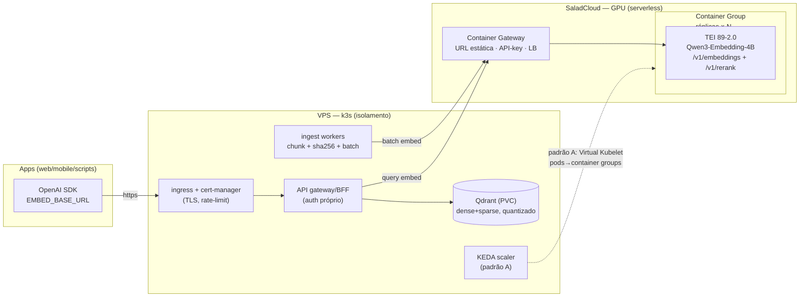

# Embedding em Nuvem para RAG — Diretórios Recursivos
## VPS + Kubernetes (k3s) isolando o container ➞ GPU no SaladCloud

> **Tema**: endpoint de embedding LLM OpenAI-compat para apps RAG indexarem árvores de diretórios — versão cloud com GPU distribuída.
> **Verificar no seu VPS/Pop!_OS**: `bash tools/verify_vps.sh --full` (incluído no repo — testa TEI/`/v1/embeddings`, Qdrant round-trip, latência, Speaches STT e Kokoro pt-BR; script pronto, não executado nesta sessão por não haver VPS aqui).
> **Fontes**: 2026 (política de tiers em `.llm-wiki/config.json`). Estimativas marcadas [inferência] — validar com benchmark.

---

## 1. Resumo executivo

Dois padrões de implantação, mesmo contrato `/v1/embeddings`:

| | **Padrão A — K8s-native** | **Padrão B — Serviço dedicado (recomendado p/ começar)** |
|---|---|---|
| Topologia | k3s no VPS + **virtual-kubelet-saladcloud** → pods agendam como container groups Salad | Container group Salad exposto pelo **Container Gateway** (URL pública + API-key); VPS consome |
| Quem roda onde | apps/Qdrant/ingestão no VPS; pods de embedding em GPU Salad | apps/Qdrant/ingestão/orquestração no VPS k3s; embedding é serviço externo |
| Escala | KEDA por métrica externa (fila) via K8s | réplicas do container group (console/API Salad) |
| Complexidade ops | média-alta (VK + KEDA + tuning) | baixa (uma URL, uma chave) |
| Quando | já existe frota K8s / múltiplos workloads GPU | um serviço de embedding p/ várias apps |

Stack de referência: **TEI v2** (imagem por compute capability) servindo **Qwen3-Embedding-4B/8B** fp16; rerank no mesmo server (`/v1/rerank`); **Qdrant** no VPS com quantização; ingestão idêntica à do doc local (mesmo `ingest.py`), com batches 64-256.

## 2. Skills aplicadas (pré-seleção skill-scout)

| Fase | Skills | Uso |
|---|---|---|
| Pesquisa | `research-ops`, `llm-wiki`, `skill-scout` | fontes tier-2026 no vault |
| Infra | `kubernetes-patterns`, `docker-patterns` | manifests k3s, imagem TEI |
| Segurança | `security-review`, `security-and-hardening` | gateway, TLS, secrets, network policy |
| Medição | `benchmark`, `observability-and-instrumentation`, `latency-critical-systems` | p95, throughput, SLO |
| Custo | `cost-aware-llm-pipeline` | break-even self-host vs API |

## 3. Arquitetura



## 4. Servidor GPU: TEI v2 (e alternativas)

- TEI = servidor Rust da HF com `/v1/embeddings`, `/v1/rerank`, `/v1/predict` — **OpenAI-compat**, batching server-side.
- Imagem por compute capability: `89-2.0` (RTX 40xx — o consumidor-top do Salad), `86-2.0` (A10/A40), `2.0` (A100), `hopper-2.0` (H100), `rocm-2.0` (Instinct). **GPUs AMD RX do Salad (RX 7800 XT etc.) não têm TEI** → usar llama.cpp com backend Vulkan (mesma API `/v1/embeddings` do doc local).
- Launch de referência:

```bash
docker run --gpus all -p 8080:80 ghcr.io/huggingface/text-embeddings-inference:89-2.0 \
  --model-id Qwen/Qwen3-Embedding-4B --dtype float16 \
  --max-batch-tokens 65536 --max-concurrent-requests 512
```

- Modelo na imagem (bake no build) reduz cold start — container groups Salad partem da imagem; baixar 4B do HF a cada restart dói.
- Candidato a upgrade: **KaLM-Embedding-Gemma3-12B-2511** (SOTA MMTEB ~72.3, licença comercial-OK, GGUFs i1) — exige GPU 24GB (3090/4090-class) [inferência de VRAM]; só se o eval no seu corpus superar o Qwen3.
- Rerank: `--model-id Qwen/Qwen3-Reranker-4B` num segundo container group (ou bge-reranker-v2-m3 no Infinity).

## 5. SaladCloud — o que é verdade e o que é trade-off

**Fatos (docs Salad, 2026):**
- Container Group = imagem + requisitos de hardware (GPU class, vCPU, RAM, disco) + replica count.
- **Container Gateway**: porta custom, **API-key opcional por request**, **URL estática** com load-balance entre réplicas, IPv4/IPv6. Resolve o inbound.
- Storage **efêmero** → workload precisa ser stateless (embedding é).
- Preços a partir de **$0.01/hr**, 37+ GPUs (ComputePrices, review 03/2026); valores por GPU conferir na calculadora.
- "Secure GPU Clusters" = nós de datacenter para exigências corporativas.

**Trade-offs (nós comunitários):**
- Churn/restart sem aviso → design idempotente: healthcheck, retry com backoff no cliente, réplicas ≥2 para SLO.
- Cold start ao escalar réplicas → modelo baked na imagem; aquecer com ping periódico se latência p95 for crítica [inferência].
- Hardware heterogêneo → fixe GPU class no grupo para perf previsível.
- **Dados sensíveis?** Nó comunitário = máquina de terceiro. Documentos privados → Secure GPU Clusters, ou permanecer no stack local (doc gêmeo).

## 6. Padrão B (passo-a-passo) — recomendado p/ começar

1. **Imagem** `Dockerfile`:

```dockerfile
FROM ghcr.io/huggingface/text-embeddings-inference:89-2.0
# bake do modelo (opcional, reduz cold start):
# COPY --from=hf-download /model /model
ENV TEI_PORT=80
ENTRYPOINT ["text-embeddings-inference", "--model-id", "/model", "--dtype", "float16", \
  "--max-batch-tokens", "65536", "--max-concurrent-requests", "512"]
```

2. **Container group** (console Salad ou API): push da imagem no registry (GHCR/OCIR), GPU class RTX 4070/A5000-class, 4 vCPU/8GB, réplicas 1-2.
3. **Gateway**: port 80, **API-key auth ON**; anote a URL estática.
4. **VPS k3s**: `k3s --disable traefik` (ou mantenha), namespace `rag`, Secrets (`SALAD_KEY`, `HF_TOKEN`), NetworkPolicy default-deny, Qdrant Deployment+PVC, ingress com cert-manager (TLS) na frente do BFF.
5. **Ingestão**: mesmo `ingest.py` do doc local apontando `EMBED_BASE_URL=https://<gateway-salad>/v1`; batches 64-256; checkpoint por sha256 (recomeça de onde parou).
6. **Apps**: `base_url` = BFF do VPS (TLS+auth próprios) que fan-out para Salad — nunca exponha a chave Salad às apps.

## 7. Padrão A — virtual-kubelet (quando a frota K8s já existe)

- `SaladTechnologies/virtual-kubelet-saladcloud` registra um node virtual no k3s; `Deployment` com `nodeSelector` para o node Salad vira container group.
- KEDA ScaledObject sobre a fila de ingestão (Redis/queue depth via API externa) escala réplicas do pod → VK traduz para réplicas do container group.
- Vantagem: `kubectl rollout`, probes e Service do K8s padrão. Atenção: node virtual não honra todos os recursos K8s (PVC, DaemonSet não se aplicam) [inferência — validar na doc do VK].

## 8. Isolamento no VPS (k8s-workload-isolation)

- Namespace `rag`; **NetworkPolicy**: default-deny ingress/egress; libere só BFF→Qdrant, workers→gateway Salad (egress por FQDN se usar Cilium; senão por IP/porta).
- `SecurityContext`: `runAsNonRoot`, sem `privileged`/`hostPID`, `readOnlyRootFilesystem` + emptyDir para tmp.
- RuntimeClass **gVisor/Kata** para os pods que tocam conteúdo externo (parser de PDFs!) — superfície de ataque de parsers é real.
- Recursos: requests/limits (workers 200m/512Mi; Qdrant 1-2 CPU/2-4Gi); HPA nos workers; Qdrant com PVC e backup snapshot.
- Secrets: Salad API key e HF token via `Secret` + (melhor) SOPS/sealed-secrets. Nunca na imagem.
- TLS: cert-manager + Let's Encrypt no ingress do k3s; mTLS interno opcional (Linkerd).

## 9. Custos

| Item | Estimativa | Base |
|---|---|---|
| VPS 2vCPU/4GB (k3s+Qdrant+BFF) | ~$5-12/mês | mercado 2026 |
| GPU Salad RTX 4070-class | ~$0.02-0.05/hr [inferência; conferir calculadora] | entrada $0.01/hr (ComputePrices) |
| Embedding de 1M tokens (4B, batch) | minutos de GPU ≈ <$0.01 [inferência] | TEI 65536 batch-tokens |
| API paga comparável | $0.06-0.15/1M (voyage/gemini) | PremAI 2026 |

**Break-even** [inferência]: self-host no Salad compensa acima de ~10-50M tokens/mês (ingestão contínua/re-indexações frequentes) OU quando privacidade/controle de modelo mandarem. Abaixo disso, API paga é menos ops. Detalhe na [DECISÃO](EMBED-RAG-DECISAO.md).

## 10. SLO e medição

- p95 de 1 embedding via gateway (rede incluída) — meta inicial <300ms com 2 réplicas [inferência].
- Throughput ingestão: tokens/s sustentados por réplica; escalar réplicas até estourar budget.
- Disponibilidade: taxa de 5xx do gateway; alerta de churn (réplica caiu/restartou).
- Qualidade: mesmo gold set do doc local — **recall@10 idêntico** entre local (0.6B) e cloud (4B) não é garantido; medir ambos.

## 11. Limites e riscos

| Risco | Mitigação |
|---|---|
| Churn de nó comunitário | réplicas ≥2, retry/backoff, healthcheck, idempotência |
| Cold start | modelo na imagem; warm-up programado |
| Chave Salad exposta | BFF no VPS é o único portador |
| Dados sensíveis em nó de terceiro | Secure GPU Clusters ou fica local |
| VK não suporta PVC/DaemonSet | stateful fica no VPS; pods Salad = stateless |
| Quebra de contrato TEI↔llama.cpp (nuances) | fixar `dimensions=1024` + gold set de regressão de embedding (distância cosseno entre endpoints < ε) |
| Custo GPU ociosa | escala a 0 fora do batch (replica count 0→N via API/KEDA) |

**Versionamento do índice e fallback (gap fechado em revisão):**
- Mudança de modelo/dims = re-embed total. Versione a collection (`chunks-qwen3emb4b-1024-v2`) e troque o **alias** do Qdrant atomicamente depois do gold set aprovar; apps nunca apontam collection crua, apontam alias.
- Fallback: o contrato idêntico ao [doc local](EMBED-RAG-LOCAL.md) permite cadeia `cloud → local` (ou o inverso) só trocando `EMBED_BASE_URL` — BFF pode implementar failover automático com health check. Estratégia completa em [DECISÃO](EMBED-RAG-DECISAO.md).

## 12. Checklist de implantação cloud

- [ ] imagem TEI com modelo baked; `/health` ok no container group
- [ ] gateway com API-key ON; p95 medido com 2 réplicas
- [ ] k3s: NetworkPolicy default-deny + TLS no ingress + Secrets
- [ ] ingestão idempotente (sha256) com checkpoint; batch ≥64
- [ ] Qdrant: quantização ON, snapshot/backup agendado
- [ ] BFF próprio (apps nunca veem a URL Salad)
- [ ] teste de queda de réplica (kill) sem erro visível ao cliente

## 13. Fontes (2026)

1. [SaladCloud docs — Container Groups](https://docs.salad.com/container-engine/explanation/container-groups/container-groups) + Container Gateway (networking)
2. [SaladTechnologies/virtual-kubelet-saladcloud](https://github.com/SaladTechnologies/virtual-kubelet-saladcloud)
3. [ComputePrices — Salad (37+ GPUs, from $0.01/hr)](https://computeprices.com/providers/salad) (review 03/2026)
4. [Hugging Face TEI](https://github.com/huggingface/text-embeddings-inference) (v2)
5. [Qdrant — quantização](https://qdrant.tech/documentation/manage-data/quantization) / [híbrido](https://qdrant.tech/articles/hybrid-search)
6. [tencent/KaLM-Embedding-Gemma3-12B-2511](https://huggingface.co/tencent/KaLM-Embedding-Gemma3-12B-2511) (nov/2025, vigente 2026)
7. [PremAI — Best Embedding Models 2026](https://www.premai.io/blog/best-embedding-models-for-rag-2026-ranked-by-mteb-score-cost-and-self-hosting/) (full-text)

Espelho no wiki: `.llm-wiki/wiki/syntheses/cloud-embedding-stack.md`.
