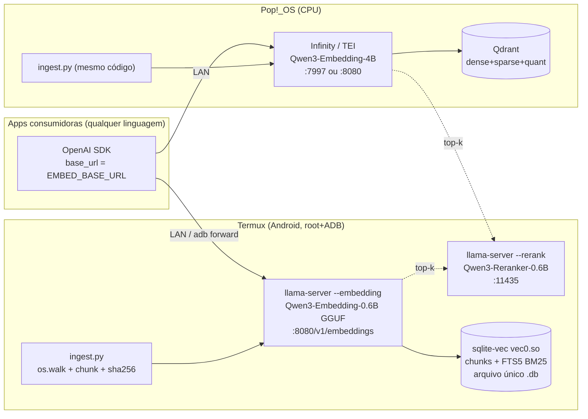

# Embedding Local para RAG — Diretórios Recursivos
## Ambiente 1: Android/Termux (root + ADB) · Ambiente 2: Pop!_OS (CPU)

> **Tema**: endpoint de embedding LLM OpenAI-compat para apps RAG indexarem árvores de diretórios.
> **Gêmeo deste doc**: [EMBED-RAG-CLOUD.md](EMBED-RAG-CLOUD.md) (VPS + k3s + SaladCloud GPU) — mesmo tema, outro ambiente. Decisão final: [EMBED-RAG-DECISAO.md](EMBED-RAG-DECISAO.md).
> **Fontes**: 2026 (política de tiers em `.llm-wiki/config.json` · síntese em `.llm-wiki/wiki/`). Itens verificados neste dispositivo: marcados ✅.

---

## 1. Resumo executivo

| Camada | Termux (Android arm64) | Pop!_OS (CPU x86_64) |
|---|---|---|
| Modelo | Qwen3-Embedding-**0.6B** GGUF Q8_0 (~640 MB, 1024 dims) | Qwen3-Embedding-**4B** (Q4/Q8 GGUF ou HF safetensors) |
| Servidor | **llama.cpp** `llama-server --embedding` (build nativo, sem root) | **Infinity** `--engine optimum` (ONNX, pip) ou **TEI** `cpu-2.0` (Docker) ou llama.cpp |
| Endpoint | `http://127.0.0.1:8080/v1/embeddings` (+ `--rerank` na 11435) | `http://127.0.0.1:7997/v1/embeddings` (Infinity) ou `:8080` (TEI/llama.cpp) |
| Vector store | **sqlite-vec** `vec0.so` (✅ verificado) + FTS5 para BM25 | **Qdrant** (Docker; híbrido + quantização) ou sqlite-vec |
| Reranker | Qwen3-Reranker-0.6B GGUF (`--rerank`) | bge-reranker-v2-m3 (Infinity/TEI) ou Qwen3-Reranker-4B |
| Papel | nó edge/offline, índice no bolso | dev +-serving LAN para as apps |

Princípio nº 1 (**contract-first**): apps só conhecem `base_url` + `model` + `dimensions=1024`. Trocar Termux↔Pop!_OS↔Cloud↔API é variável de ambiente, não refactor. Isso vale porque llama.cpp, TEI e Infinity expõem o mesmo `/v1/embeddings` OpenAI-compat, e a família Qwen3-Embedding usa MRL para truncar qualquer variante a 1024 dimensões com perda ~marginal.

## 2. Skills aplicadas (pré-seleção skill-scout)

| Fase | Skills | Uso |
|---|---|---|
| Pesquisa | `research-ops`, `llm-wiki`, `skill-scout` | vault `.llm-wiki/`, fontes tier-2026 |
| Implementação | `python-patterns`, `content-hash-cache-pattern` | walker + chunker + cache por sha256 |
| Serving | `benchmark`, `observability-and-instrumentation` | throughput docs/s, p95, saúde do endpoint |
| Docs | `markdown-mermaid-writing` | este doc |

## 3. Arquitetura



## 4. Modelo: por que Qwen3-Embedding (2026)

- **#1 open-source no MTEB multilingual** (70.58 na variante 8B), Apache 2.0, ctx 32K, MRL 32→7168 dims; variantes 0.6B/4B/8B — uma família só do telefone ao servidor (fonte: [PremAI 2026, full-text](https://www.premai.io/blog/best-embedding-models-for-rag-2026-ranked-by-mteb-score-cost-and-self-hosting/)).
- **Instruction-aware**: prefixar `Instruct: Given a web search query, retrieve relevant passages that answer the query\nQuery:` em *queries* melhora +1-5%. Padronize o prefixo no cliente/servidor — nunca diferente entre index e query.
- 0.6B = 1024 dims **nativo**: é a âncora do `dimensions=1024` do projeto.
- Alternativas: BGE-M3 (MIT; dense+sparse num modelo — bom se quiser híbrido sem BM25 separado); KaLM-Gemma3-12B é SOTA mas 12B (GPU-only — ver doc cloud); NV-Embed-v2 **vetado** (CC-BY-NC).
- Regra 2026: score de leaderboard ≠ seu corpus. Rode eval de recall@k numa amostra antes de re-embeddar tudo.

## 5. Ambiente 1 — Termux (Android, com root + ADB)

### 5.1 Build do llama.cpp (nativo, não precisa do root)

```bash
pkg update && pkg upgrade -y
pkg install -y git clang cmake ninja python libandroid-spawn wget unzip
git clone --depth 1 https://github.com/ggml-org/llama.cpp ~/llama.cpp
cd ~/llama.cpp
cmake -B build -DGGML_NATIVE=ON -DLLAMA_BUILD_TESTS=OFF -DLLAMA_BUILD_EXAMPLES=OFF -DCMAKE_BUILD_TYPE=Release \
  && cmake --build build --target llama-server -j"$(nproc)"
# binário: ~/llama.cpp/build/bin/llama-server (+ libs .so no mesmo dir — rodar com LD_LIBRARY_PATH)
```

> ✅ **VERIFICADO NESTE DISPOSITIVO (2026-09-14, 8 cores arm64, Clang 21.1.8)**: build do alvo `llama-server` em **4m54s**; binário v0.4.1-dev "built for Android aarch64". (NDK só p/ APK — o build clang nativo do Termux produz o server normalmente; docs/android.md, 2026.)

### 5.2 Modelo + servidor de embedding

```bash
mkdir -p ~/models && cd ~/models
# GGUF OFICIAL da família (repositório da própria Qwen — verificado; Q8_0 = 639.150.592 bytes):
wget https://huggingface.co/Qwen/Qwen3-Embedding-0.6B-GGUF/resolve/main/Qwen3-Embedding-0.6B-Q8_0.gguf
# Atalho equivalente: llama-server --hf-repo Qwen/Qwen3-Embedding-0.6B-GGUF --hf-file Qwen3-Embedding-0.6B-Q8_0.gguf …

cd ~/llama.cpp/build/bin   # libs compartilhadas ficam aqui
LD_LIBRARY_PATH=. ./llama-server \
  -m ~/models/Qwen3-Embedding-0.6B-Q8_0.gguf \
  --embedding --pooling last \
  --host 127.0.0.1 --port 8080 \
  -c 8192 -t 6
```

> ✅ **VERIFICADO NESTE DISPOSITIVO (2026-09-14)**: carga do modelo **3,15s** (mmap) → `listening on http://127.0.0.1:8080`; `/health` = `{"status":"ok"}`; `/v1/embeddings` devolveu **1024 dims** (nativo do 0.6B) com `usage` correto; **1 input = 135ms**, **batch de 8 = 253ms** (~32ms/input curto). Aviso inofensivo no log: `n_batch (2048) > n_ubatch (512)` — batching segue funcionando; aumente `--ubatch` só se medir ganho.

Rotas: `/v1/embeddings` (OpenAI-compat, para as apps) e `/embeddings` (nativa — pooling por token, útil p/ late chunking). `-t 6` deixa 2 cores para o sistema (thermal). Nota de versão: `--mlock` não existe mais no llama-server atual — quem quiser travar o modelo em RAM usa `--mmap mmap+mlock`.

Teste imediato:

```bash
curl -s http://127.0.0.1:8080/v1/embeddings \
  -H 'Content-Type: application/json' \
  -d '{"model":"qwen3-embedding-0.6b","input":"teste de embedding local"}' | head -c 300
```

### 5.3 Reranker no mesmo binário (opcional, recomendado)

```bash
~/llama.cpp/build/bin/llama-server -m ~/models/Qwen3-Reranker-0.6B-Q8_0.gguf \
  --rerank --host 127.0.0.1 --port 11435 -c 8192 -t 6
# payload: {"model":"rerank","query":"...","documents":["...","..."]}
```

⚠️ Muitos GGUFs de reranker no HF estão quebrados (sem `cls.output.weight`/`pooling_type=RANK`). Use conversões com `convert_hf_to_gguf.py` oficial ou coleções testadas (mar/2026).

### 5.4 Persistência/daemon + acesso externo (root e ADB)

- **Daemon**: `tmux new -d -s emb '<comando acima>'` ou `pkg install termux-services` + runit service. Boot-start: app Termux:Boot.
- **Root**: útil para `sysctl`/governor, bind em porta <1024 (`tsu`), e blindar contra OOM killer (`echo -900 > /proc/$(pidof llama-server)/oom_score_adj`).
- **ADB (desktop→telefone)**: `adb forward tcp:8080 tcp:8080` → apps no desktop usam `http://127.0.0.1:8080/v1` do telefone. Na mesma rede: `--host 0.0.0.0` + `sshd` do Termux (porta 8022) para túnel.
- **Térmica**: ingestão grande no telefone = throttling. Use para queries e corpus pequenos; ingestão massiva → Pop!_OS/cloud.

### 5.5 Vector store — sqlite-vec (✅ verificado neste dispositivo, 2026-09-14)

`pip install sqlite-vec` **falha** no Termux (sem wheel android/cp314). Caminho que funciona:

```bash
mkdir -p ~/lib && cd ~/lib
curl -sfL -o vec.tar.gz \
  https://github.com/asg017/sqlite-vec/releases/download/v0.1.9/sqlite-vec-0.1.9-loadable-android-aarch64.tar.gz
tar xzf vec.tar.gz   # → vec0.so (ELF aarch64, Android 21+, NDK r27)
```

```python
import sqlite3, struct
db = sqlite3.connect("rag.db")
db.enable_load_extension(True)
db.load_extension("/data/data/com.termux/files/home/lib/vec0")   # sem o .so
db.enable_load_extension(False)
db.executescript("""
CREATE VIRTUAL TABLE IF NOT EXISTS chunks USING vec0(embedding float[1024]);
CREATE TABLE IF NOT EXISTS files(
  path TEXT PRIMARY KEY, sha256 TEXT, mtime REAL, updated_at TEXT);
CREATE TABLE IF NOT EXISTS chunk_meta(
  rowid INTEGER PRIMARY KEY, file_path TEXT, idx INTEGER, text TEXT);
CREATE VIRTUAL TABLE IF NOT EXISTS chunks_fts USING fts5(text, file_path);
""")

def upsert(vec, file_path, idx, text):
    db.execute("INSERT INTO chunks(rowid, embedding) VALUES (NULL, ?)",
               (struct.pack("1024f", *vec),))  # obter rowid via cursor.lastrowid e gravar chunk_meta+fts
```

Consulta híbrida (KNN + BM25 + fusão simples):

```sql
-- dense
SELECT rowid, distance FROM chunks WHERE embedding MATCH :qvec AND k = 50 ORDER BY distance;
-- lexical
SELECT rowid, bm25(chunks_fts) FROM chunks_fts WHERE chunks_fts MATCH :query LIMIT 50;
-- fusão RRF no Python: score = Σ 1/(60 + rank)
```

Verificação executada: `vec_version()=v0.1.9`, KNN 1024-dim com distâncias corretas (L2). Escala: brute-force KNN — ms até ~centenas de milhares de vetores; acima disso → Qdrant.

## 6. Ambiente 2 — Pop!_OS (CPU)

Opções de servidor (mesmo contrato):

```bash
# A) Infinity — pip, ONNX CPU, embeddings+rerank juntos (recomendado p/ começar)
pip install 'infinity-emb[all]'
infinity_emb v2 --model-id Qwen/Qwen3-Embedding-4B --engine optimum --port 7997
#   (se o download do 4B pesar: começar com Qwen3-Embedding-0.6B ou snowflake-arctic-embed-m)

# B) TEI — Docker, cpu x86_64
docker run -p 8080:80 ghcr.io/huggingface/text-embeddings-inference:cpu-2.0 \
  --model-id Qwen/Qwen3-Embedding-0.6B --max-concurrent-requests 256

# C) llama.cpp — mesmo binário do Termux (build cmake), GGUF 4B Q4_K_M
```

Qdrant com quantização + híbrido:

```bash
docker run -d -p 6333:6333 -v $PWD/qdrant_data:/qdrant/storage qdrant/qdrant
# collection: dense 1024d (scalar/binary quantization ON) + sparse vector p/ híbrido
```

- Binary quantization: até **32× menos RAM / 40× mais rápido** com 2-5% de perda de recall (docs Qdrant 2026) — primeira otimização a ligar.
- Híbrido server-side pela Query API (prefetch dense+sparse + `fusion: rrf`) — sem código de fusão no cliente.

## 7. Ingestão de diretórios recursivos (comum aos dois ambientes)

Pipeline `ingest.py` (um arquivo, ~150 linhas, sem framework — ou LlamaIndex `SimpleDirectoryReader(recursive=True)`):

1. **Walk**: `os.walk(root)`, respeitar `.gitignore` (ex.: `pathlib` + `gitignore-parser`), filtrar extensões (`.md .txt .py .rs .ts .java .json .yaml .pdf`).
2. **Identidade**: `sha256(conteúdo)` por arquivo → tabela `files`. Sem mudança de hash → pula (idempotente entre dispositivos).
3. **Chunk**: 200-400 tokens (contados com o tokenizer do modelo), overlap 20-30%; código → por AST/função; metadados por chunk: `path` relativo, `idx`, `header`/seção, `sha256` do arquivo.
4. **Embed em batch**: 16-64 inputs por request (`input: [...]` aceita lista). Prefixo de instrução: documento sem prefixo, query com prefixo — e consistente para sempre.
5. **Upsert**: sqlite (`rowid` + `chunk_meta`) ou Qdrant com point id determinístico `sha256(path+idx)` → re-index sem duplicar.
6. **Watcher**: `watchdog` (inotify) → reprocessa só o arquivo alterado. Single-writer (lock) para não corromper o índice.

Tendências 2026 aplicadas ([guias de chunking](https://www.premai.io/blog/rag-chunking-strategies-the-2026-benchmark-guide)):
- **Late chunking** para docs longos (embeda inteiro → recorta) — na prática local, a rota `/embeddings` nativa do llama.cpp com pooling por token dá o primitivo.
- **Contextual retrieval** (prefixo de contexto gerado por LLM) — só vale com LLM local/API disponível; adia para fase 2.
- Ordem de impacto: chunking decente > híbrido+RRF > reranker > trocar modelo.

### 7.1 Versionamento do índice (gap fechado em revisão)

Trocar modelo/dims/prefixo invalida o índice inteiro (embedding não é comparável). Regras:
- Nomeie o índice com a versão semântica: coleção Qdrant `chunks-qwen3emb-1024-v1` (ou tabela sqlite `chunks_v1`); nunca escreva em cima do índice ativo.
- Migração = popular `v2` em paralelo (mesmo `ingest.py`, novo destino), rodar o gold set nos dois, trocar o **alias** apontado pelas apps (Qdrant alias é atômico; no sqlite, variável `INDEX_TABLE`).
- Teste de regressão de embedding: 100 textos fixos → cosseno entre endpoints (local vs cloud) deve ficar >0.98; abaixo disso, os ambientes não são intercambiáveis [limiar empírico — calibre].

## 8. Consumo pelas apps

```python
from openai import OpenAI  # qualquer SDK OpenAI
emb = OpenAI(base_url="http://127.0.0.1:8080/v1", api_key="local")
r = emb.embeddings.create(model="qwen3-embedding-0.6b",
                          input=["doc A", "doc B"], dimensions=1024)
# Termux: 127.0.0.1 na própria app no device; desktop→device: adb forward ou --host 0.0.0.0 (firewall!)
```

- Padronize env: `EMBED_BASE_URL`, `EMBED_MODEL`, `EMBED_DIMS=1024`, `RERANK_BASE_URL`.
- Segurança: `--host 0.0.0.0` só em rede confiável; prefira túnel (ssh/adb). Nada de auth no llama-server — se precisar expor, ponha proxy com API-key na frente.

## 9. Medição (benchmark)

- **Throughput**: docs/s na ingestão (batch 32) — ✅ medido no Termux (Qwen3-0.6B Q8, 8 cores): 135ms/input solo, 253ms p/ batch de 8 inputs curtos → docs de ~300 tokens: **~0,3-1s/doc** [inferência a partir do medido]; Pop!_OS CPU espera ~5-40 docs/s (ONNX int8) [estimativa].
- **Latência**: p50/p95 de 1 embedding (query-path).
- **Qualidade**: monte 20-50 pares (query → arquivo esperado) do SEU corpus; meça recall@10 e MRR antes/depois de cada mudança (híbrido, reranker, dims).

## 10. Limites e riscos

| Risco | Mitigação |
|---|---|
| Térmica/RAM no telefone (0.6B Q8 ≈ 0,7 GB) | `-t 6`, `--mlock`, ingestão pesada no desktop |
| sqlite brute-force escala | >300-500k chunks → migrar p/ Qdrant (export: dump rows → upsert) |
| GGUF de reranker quebrado | só conversões oficiais/testadas |
| Trocar dims depois | não troque: `dimensions=1024` desde o dia 1 (MRL) |
| Modelo servido difere entre ambientes | mesma família + mesmo prefixo de instrução; eval de recall comparativo |
| Índice corrompido por escrita concorrente | single-writer + WAL no sqlite |
| Corpus de terceiros (PDF/docx malicioso) | parser de ingestão é código que roda no seu host — sandbox/VM/container se o diretório não é confiável |
| Trocar família de modelo | índice vira lixo: versionar (7.1) e re-embeddar com gold set comparativo |

## 11. Checklist de implantação local

- [ ] llama-server `--embedding` no ar (curl responde 200)
- [ ] `vec0.so` carrega (`select vec_version()`)
- [ ] ingest.py roda idempotente (2ª execução = 0 re-embeds)
- [ ] recall@10 ≥ alvo no gold set próprio
- [ ] rerank ligado e medindo ganho
- [ ] apps apontando `EMBED_BASE_URL` (nada hardcoded)

## 12. Fontes (2026)

1. [PremAI — Best Embedding Models for RAG 2026](https://www.premai.io/blog/best-embedding-models-for-rag-2026-ranked-by-mteb-score-cost-and-self-hosting/) (full-text)
2. [llama.cpp docs/android.md](https://github.com/ggml-org/llama.cpp/blob/master/docs/android.md) (living)
3. [Software.Land — llama.cpp embeddings API](https://software.land/working-with-llama-cpp-embeddings) (TIER B)
4. [sqlite-vec releases](https://github.com/asg017/sqlite-vec) — v0.1.9 **verificado localmente**
5. [TEI repo](https://github.com/huggingface/text-embeddings-inference) (v2)
6. [Infinity repo](https://github.com/michaelfeil/infinity)
7. [Qdrant — quantização](https://qdrant.tech/documentation/manage-data/quantization) / [híbrido](https://qdrant.tech/articles/hybrid-search)
8. [PremAI — Chunking 2026](https://www.premai.io/blog/rag-chunking-strategies-the-2026-benchmark-guide)
9. [Qwen3-Reranker GGUF testadas](https://huggingface.co/collections/Voodisss/qwen3-reranker-gguf-for-llamacpp) (mar/2026)

Espelho no wiki: `.llm-wiki/wiki/syntheses/local-embedding-stack.md`.
