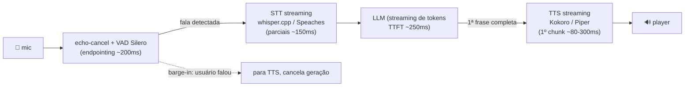

# Conversa por Voz com LLM — STT (áudio➞texto) + TTS (texto➞áudio)
## Objetivo: conversar fluentemente com o modelo — local (Termux/Pop!_OS) e VPS/Salad

> **Verificar no VPS/Pop!_OS**: `bash tools/verify_vps.sh --full` cobre as etapas 4-5 (Speaches + Kokoro pt-BR). No Termux, whisper.cpp segue o mesmo toolchain do llama.cpp já verificado em [EMBED-RAG-LOCAL](EMBED-RAG-LOCAL.md) §5.1.
> **Fontes 2026** no vault `.llm-wiki/`. PT-BR em primeira classe (vozes e idioma). Estimativas marcadas [inferência].

---

## 1. Resumo executivo

| Camada | Escolha 2026 | Por quê |
|---|---|---|
| STT (áudio➞texto) | **whisper.cpp** (Termux/edge) · **Speaches/faster-whisper** (VPS/Pop!_OS, OpenAI-compat) | whisper.cpp compila nativo no Termux (mesmo toolchain do llama.cpp); Speaches expõe `/v1/audio/transcriptions` com streaming e é 2-4× mais rápido que whisper Py |
| Modelo STT | `small` (tempo real) → `large-v3` (qualidade/GPU) | tiny/base perdem em PT com ruído; small é o ponto de equilíbrio local |
| TTS (texto➞áudio) | **Kokoro-82M** (qualidade, Apache 2.0, CPU RTF<1) · **Piper** (ultra-leve) | Kokoro topo do TTS Arena local em CPU; **PT-BR nativo: `pf_dora`, `pm_alex`, `pm_santa`**; Piper tem `pt_BR-faber-medium` e roda em quase nada |
| LLM | qualquer (Qwen3 etc.) | fora do escopo deste doc — só o contrato |
| Cola | **Silero VAD** + sentence-boundary streaming + barge-in | é isso que faz parecer fluido, não o modelo |

Regra de bolso: **fluidez vem do pipeline (streaming + VAD), qualidade de voz vem do TTS**. Um large-v3 + ElevenLabs num pipeline não-streaming parece robotizado; small + Piper com sentence-streaming parece atento.

### 1.1 Papéis dos modelos — o endpoint de embedding serve para voz?

| Modelo | Papel | Serve para voz? |
|---|---|---|
| **Qwen3-Embedding-0.6B** (endpoint no Android, já verificado) | **RAG**: transforma texto em vetor p/ busca semântica | **Indireto, sim** — é a parte de *conhecimento*: quando você pergunta algo por voz e a resposta vem dos seus diretórios, o fluxo é `STT ➞ LLM ➞ (query ➞ embedding endpoint ➞ vector store) ➞ resposta`. Ele **não** processa áudio nem gera fala. |
| STT (whisper.cpp/Speaches) | áudio ➞ texto | direto |
| LLM (Qwen3 etc.) | raciocínio/resposta | direto |
| TTS (Kokoro/Piper) | texto ➞ áudio | direto |

Ou seja: um assistente de voz **usa os quatro** — o endpoint de embedding é o que dá acesso ao seu knowledge base dentro da conversa.

### 1.2 Qualidade do modelo de embedding (parâmetro: o padrão mais usado)

Veredito: **BOA — igual ou superior ao padrão de mercado**, mesmo sendo a variante menor da família. Números oficiais (model card Qwen / arXiv 2506.05176, 2025-2026 vigentes):

| Modelo | MTEB-R (retrieval EN) | MMTEB-R (multiling.) | MTEB-Code | Veredito |
|---|---|---|---|---|
| **Qwen3-Embedding-0.6B** (seu Android) | **61.82** | **64.64** | **75.41** | **Boa** — bate o padrão em retrieval; topo em código |
| OpenAI text-embedding-3-large (o "padrão mais usado" de API) | 58.93 | ~62 | ~63 | referência |
| Qwen3-Embedding-8B (cloud/GPU) | 70.58 MTEB | #1 open-source | — | excelente (custa GPU) |

Leitura prática: o 0.6B no telefone **não é "versão fraca"** — perde só para as irmãs maiores (4B/8B) e para o SOTA 12B, todos exigindo GPU/desktop. Para PT-BR (MMTEB 64.64) e repositórios de código (75.41 — o maior uso num knowledge base de diretórios de dev), está acima do padrão comercial mais usado. Upgrades só se o gold set do SEU corpus mostrar ganho.


## 2. Arquitetura do loop de voz



**Budget de latência 2026** (produção, medidos por fontes do ano): VAD 200ms + STT final 100-150ms + LLM TTFT ~250-300ms + 1ª frase → TTS chunk 80-300ms = **~400-750ms até o primeiro áudio** — abaixo disso o usuário percebe como "fluído" (turn-taking humano ≈ 200ms; sub-800ms é confortável). Local em telefone: **1-2s realista** com small+Piper [inferência]. Alvo do projeto: **TTFA < 800ms local VPS/LAN, < 2s no phone**.

## 3. STT — áudio ➞ texto

### 3.1 Termux/Android (edge, offline)
Mesmo toolchain do llama.cpp (clang/cmake/ninja já instalados):

```bash
git clone --depth 1 https://github.com/ggml-org/whisper.cpp ~/whisper.cpp
cmake -S ~/whisper.cpp -B ~/whisper.cpp/build -DCMAKE_BUILD_TYPE=Release
cmake --build ~/whisper.cpp/build --target whisper-server -j8   # bin: build/bin/whisper-server
~/whisper.cpp/models/download-ggml-model.sh small              # ~466MB (base=142MB p/ testar)
~/whisper.cpp/build/bin/whisper-server -m ~/whisper.cpp/models/ggml-small.bin \
  --port 8081 --host 127.0.0.1 --language pt
# POST /inference  (multipart: file + temperature + response-format)
```
- v1.8.x (2026): manutenção focada em **VAD em streaming e estabilidade de server** — exatamente o nosso caso.
- `--convert`/quantização GGML disponível; small@int8 ≈ 250MB [inferência].

### 3.1.1 Vocabulário técnico PT-BR — jargão EN + aportuguesado (hotwords/initial prompt)

Problema real: falar PT misturado com termos técnicos EN ("vamos fazer o deploy do endpoint de embedding…") faz o Whisper "adivinhar" grafias erradas (*disploy, imbeding, repull request*). Solução sem fine-tuning: **condicionar o STT com um glossário** via `initial_prompt` (eleva a probabilidade desses tokens na decodificação — técnica documentada no [OpenAI Whisper Prompting Guide](https://developers.openai.com/cookbook/examples/whisper_prompting_guide), fórum HF e arXiv 2410.18363):

```bash
# whisper.cpp server (Termux): campo prompt no multipart POST /inference
curl http://127.0.0.1:8081/inference -F file=@fala.wav \
     -F response_format=json -F language=pt \
     -F prompt="$(grep -A1 '^PROMPT_PRONTO' tools/glossario-tech-ptbr.txt | tail -1)"
# Speaches/faster-whisper: initial_prompt=… (faster-whisper aceita também hotwords=…)
```

O arquivo **`tools/glossario-tech-ptbr.txt`** (incluído) traz: (a) um `PROMPT_PRONTO` de ~180 tokens com os termos de maior frequência; (b) dicionário completo ~120 entradas `EN | como se fala no BR (deployar, commitar, mergear, cachear…) | categoria` — usável também como pós-correção fuzzy na saída do STT antes de mandar ao LLM. Regras de ouro: prompt **curto** (é condicionamento, não lista infinita), em frase natural, contendo siglas e grafias exatas que você quer ver na transcrição.

### 3.2 Pop!_OS / VPS (Docker, OpenAI-compat)

```bash
docker run -d --name speaches -p 9000:9000 \
  -e ASR_MODEL=small -e ASR_ENGINE=faster_whisper \
  ghcr.io/speaches-ai/speaches:latest        # CPU; --gpus all p/ large-v3
curl http://localhost:9000/v1/audio/transcriptions \
  -F file=@fala.wav -F model=small -F language=pt
```

- **Speaches** = ex-`faster-whisper-server`: `/v1/audio/transcriptions` **compatível com SDK OpenAI**, streaming e live transcription; CTranslate2 int8/fp16 → 2-4× o whisper de referência; backends CPU/CUDA/Metal/Vulkan.
- Modelos: `small` tempo real CPU; `large-v3` qualidade (GPU ou paciência); `distil-whisper` para EN.
- No Salad GPU: large-v3 batch/transcrição de acervo (mesmo padrão do embedding: stateless, gateway).

## 4. TTS — texto ➞ áudio

### 4.1 Kokoro-82M (padrão de qualidade local, 2026)

- 82M params (StyleTTS-2 lineage), **Apache 2.0**, ONNX, **faster-than-real-time em CPU comum** (~4GB RAM ou <2GB VRAM), 54 vozes/8 idiomas. Topo do TTS Arena entre locais.
- **PT-BR nativo**: vozes `pf_dora` (F), `pm_alex` (M), `pm_santa` (M) no bundle `kokoro-v1.0.onnx` + `voices-v1.0.bin`.
- Serving: wrappers FastAPI expõem `/v1/audio/speech` (padrão OpenAI) — ex.: kokoro-fastapi / kokoro-onnx + camada própria.

```bash
# Pop!_OS / VPS
pip install kokoro-onnx soundfile
# baixar kokoro ONNX + voices: release model-files-v1.1 de github.com/thewh1teagle/kokoro-onnx (int8 109MB + voices 27MB); espeelho HF: onnx-community/Kokoro-82M-v1.0-ONNX
# app mínima FastAPI: POST /v1/audio/speech {input, voice:"pf_dora", response_format:"wav"}
```

⚠️ Termux: `kokoro-onnx` depende de `onnxruntime` (sem wheel Android/cp314 — mesmo problema do sqlite-vec). Rotas: `pkg install python-onnxruntime` (tur-repo) **[a validar]**, ou TTS do phone = **Piper** (abaixo), ou TTS remoto (VPS) — ver §6.

### 4.2 Piper (ultra-leve, fallback garantido)

- ONNX Runtime, <1GB RAM, mais rápido que tudo em CPU; licença MIT/GPL dual.
- PT-BR: `pt_BR-faber-medium` (M; não há voz F pt-BR nativa ainda — issue aberta no repo).
- Serving: binário standalone + HTTP wrapper; integrado em Home Assistant/Wyoming.

### 4.3 Quando precisar de mais (GPU / comercial)

- **Chatterbox** (Resemble, MIT): clonagem de voz ~5s, GPU gaming.
- **Qwen3-TTS** (Apache 2.0, clona com 3s) · **F5-TTS/Orpheus** (qualidade alta, GPU) → Salad RTX 40xx.
- API: ElevenLabs (topo comercial), OpenAI `gpt-4o-mini-tts` — mesmo contrato `/v1/audio/speech`, trocam por env var.
- **Voxtral/Breeze TTS 2** aparecem em rankings 2026 como novatos fortes — ainda sem consenso de deploy local maduro; acompanhar no MTEB/TTS Arena.

## 5. Fluidez: o que realmente importa

1. **Sentence-boundary streaming**: NÃO espere a resposta completa do LLM. Cada frase completa vai imediatamente ao TTS; o usuário ouve a 1ª enquanto a 2ª é gerada. É o maior ganho único.
2. **VAD Silero agressivo** (~30ms frames, endpointing ~200ms) para detectar fim de fala cedo — e **barge-in**: VAD detecta nova fala ➞ corta TTS + cancela geração.
3. **Echo cancellation** no cliente (senão o próprio TTS dispara o VAD).
4. **Streaming STT** (parciais) pode alimentar o LLM antes do final — opcional, aumenta complexidade.
5. Half-duplex (walkie-talkie inteligente) é o modo local simples; full-duplex real (falar por cima, tipo Moshi/Ultravox) é outro projeto — só com GPU e modelos speech-to-speech dedicados.

## 6. Topologias por ambiente (espelhando os docs de embedding)

| | Termux | Pop!_OS | VPS (+Salad p/ pico) |
|---|---|---|---|
| STT | whisper.cpp `:8081` | Speaches docker `:9000` | Speaches `:9000`; large-v3 no Salad p/ batch |
| TTS | Piper (ou **TTS remoto do VPS**) | Kokoro `:5000` | Kokoro/Piper service; F5/Chatterbox no Salad |
| Papel | edge offline; mic/speaker locais | dev + serving LAN | **hub 24/7**: phone faz só captura/playback |
| Latência alvo TTFA | 1-2s | 0.4-0.8s | 0.5-1.0s (WAN) |

**Mesma conclusão do embedding (Padrão C da DECISÃO)**: para "conversar com o modelo de qualquer lugar", o hub de voz na VPS com o phone como cliente fino é o melhor custo-benefício — STT+TTS são stateless e leves; o phone só captura áudio e toca resposta. Termux offline = modo avião.

## 7. Consumo pelas apps (contrato)

```python
from openai import OpenAI
stt = OpenAI(base_url=f"{STT_BASE_URL}/v1")   # /v1/audio/transcriptions
tts = OpenAI(base_url=f"{TTS_BASE_URL}/v1")   # /v1/audio/speech
txt = stt.audio.transcriptions.create(model="small", file=open("fala.wav","rb"), language="pt")
audio = tts.audio.speech.create(model="kokoro", voice="pf_dora", input=resposta_do_llm)
```

Env padronizado: `STT_BASE_URL`, `TTS_BASE_URL`, `LLM_BASE_URL`, `TTS_VOICE=pf_dora`, `STT_LANG=pt`.

## 8. Riscos e limites

| Risco | Mitigação |
|---|---|
| onnxruntime indisponível no Termux (Kokoro) | Piper no phone, ou TTS remoto (VPS) |
| Eco/barge-in falso | AEC no cliente + VAD com gate de energia |
| Bateria/térmica no phone | modelos small/base, sessões curtas |
| Latência WAN do hub VPS | WireGuard direto, modelos leves, sentence-streaming |
| Voz pt-BR limitada (Piper sem F) | Kokoro `pf_dora` como padrão; avaliar Chatterbox+clonagem (GPU) |
| Qualidade STT em ruído | VAD + noise gate; large-v3 no VPS p/ transcrição não-RT |

## 9. Checklist

- [ ] whisper-server responde `/inference` (Termux) ou Speaches `/v1/audio/transcriptions` (VPS)
- [ ] Kokoro/Piper gera WAV pt-BR (`pf_dora`/`faber`)
- [ ] loop VAD➞STT➞LLM➞TTS com 1ª frase em <1s (LAN) — medir TTFA
- [ ] barge-in funciona (falar durante resposta corta o áudio)
- [ ] apps só conhecem `*_BASE_URL` + `TTS_VOICE`

## 10. Fontes (2026)

1. [Self-hosted TTS comparison (Kokoro vs Piper vs XTTS/Bark)](https://gigagpu.com/self-hosted-tts-comparison)
2. [8 open-source TTS testados 2026 (Kokoro #1 CPU)](https://localaimaster.com/blog/best-local-tts-models)
3. [Best Open-Source TTS 2026 (Qwen3-TTS, Chatterbox)](https://ocdevel.com/blog/20250720-tts)
4. [SYSTRAN/faster-whisper + Speaches (OpenAI-compat server)](https://github.com/SYSTRAN/faster-whisper)
5. [whisper.cpp vs faster-whisper 2026 (v1.8.6, VAD streaming)](https://www.promptquorum.com/power-local-llm/local-whisper-stt-comparison-2026)
6. [Pipeline de voz 2026: TTFA/pipeline (arXiv 2603.05413)](https://arxiv.org/html/2603.05413v1)
7. [Barge-in/VAD <150ms (SyncSoft)](https://www.syncsoft.ai/en/blog/voice-agent-barge-in-vad-tuning-2026)
8. [Kokoro PT-BR: pf_dora/pm_alex (Space)](https://huggingface.co/spaces/leonelhs/kokoro-tts-portuguese) · [Piper pt_BR-faber](https://texttospeechai.com/tts/voices/pt_BR-faber-medium)

Espelho no wiki: `.llm-wiki/wiki/syntheses/voice-stack.md`.
